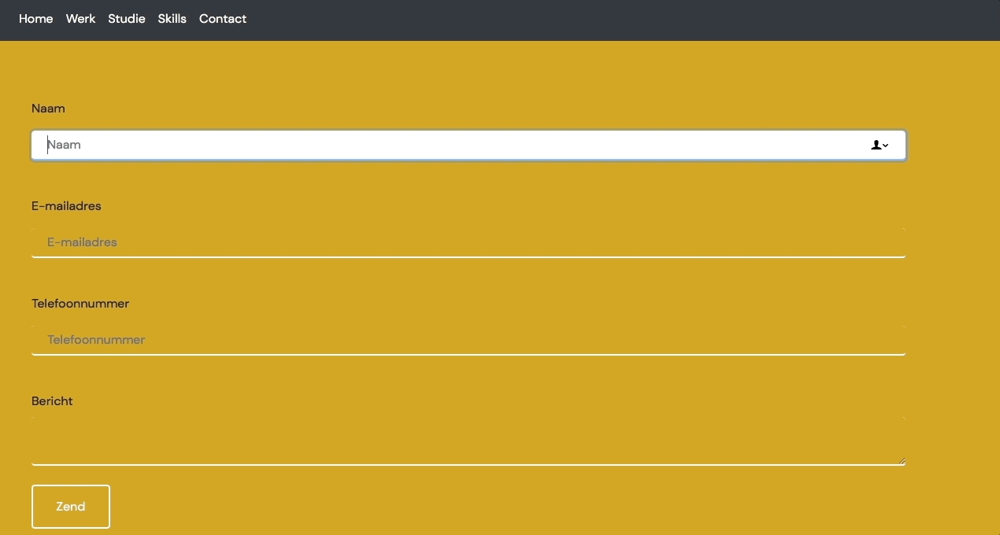

#  :page_facing_up: Java PortfolioAPP :page_facing_up:
With this app I tried out Java. I made my portolio in Java, HTML and CSS. When you fill in the form, I recieve an e-mail in my inbox. 

## :point_right: [checkout the deployed version here](https://www.merylsnieuws.nl) :point_left:

###Technologies used
- Java
- HTML
- CSS

